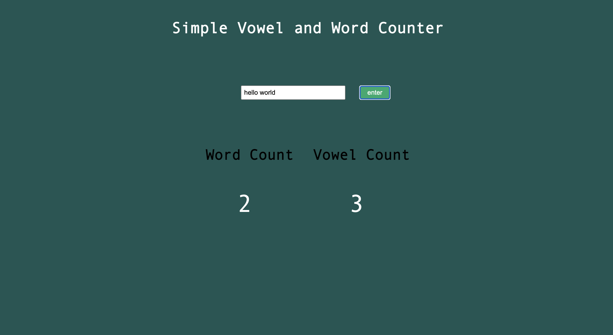

# Word and Vowel Counter App

This is a Word and Vowel Counter App that updates the number of words and vowels that a user most recently input to the text box.

# Description

Creating this project helped me build on what I have been learnign about funcitons and creating a small well designed functions that can be pieced to together to cerate a cohesive project. This project wasn't super difficult but I felt very efficient and organized in the way I wrote the code!

Access my project [here!](https://kurtis-casperson.github.io/vowel-counter/)

# Author

Hey I'm Kurtis Casperson!
Connect with me! [LinkedIn](https://www.linkedin.com/in/kurtis-casperson/)
